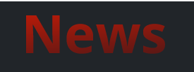
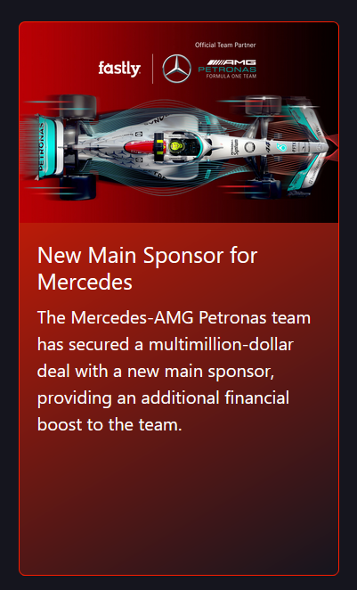
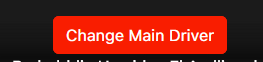
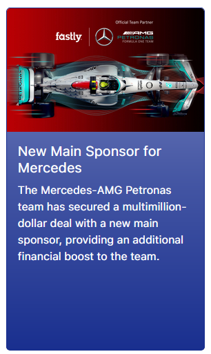
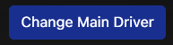
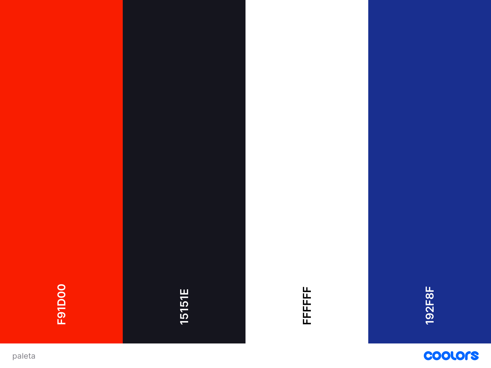
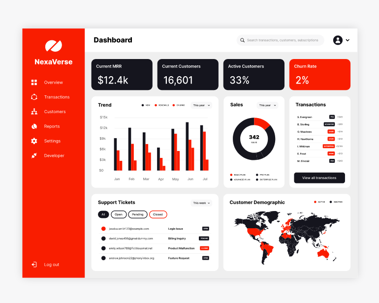
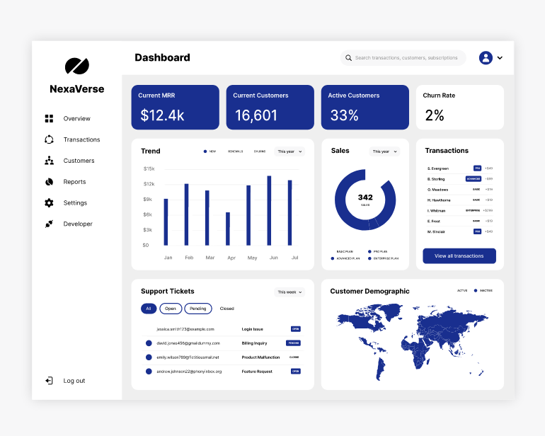
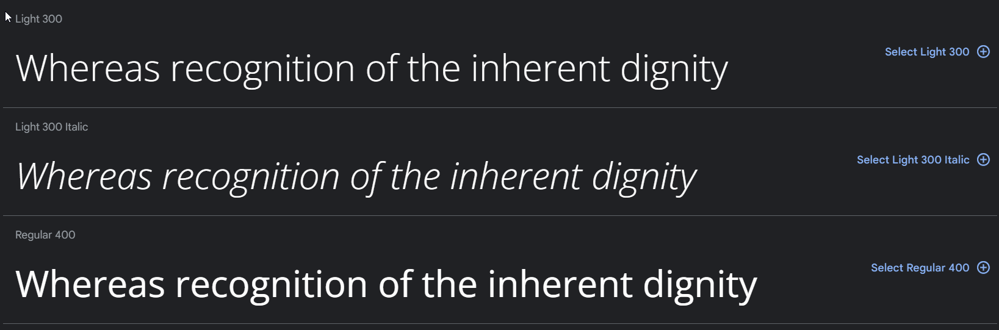
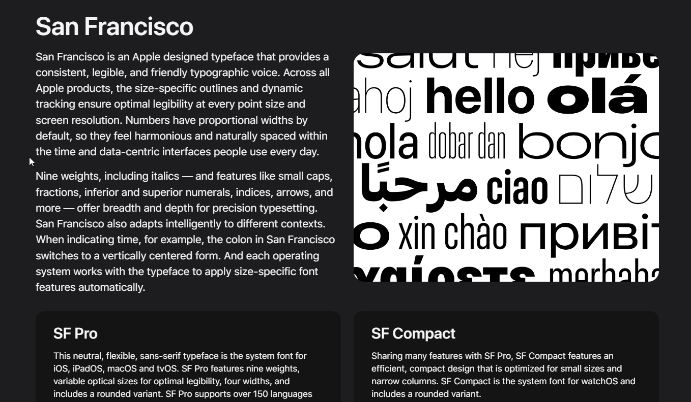

<h1 style="text-align:center">Cliente-Fantasy-F1</h1>
Realizado por: <a href="https://github.com/FranDaniels">Francisco Álvarez Bellón</a> y <a href="https://github.com/bhamidou">Badrelddin Hamidou El Aadli</a>
Realizado por: Francisco Álvarez Bellón y Badrelddin Hamidou El Aadli

<h2 style="text-align:center">Guía de Estilos</h2>

<h3 style="text-align:center">Descripción</h3>
Fantasy F1 es una plataforma web diseñada para apasionados de la Fórmula 1. Aquí, te mantendrás al tanto de las últimas noticias y análisis de las carreras más recientes.

 
Explora la información detallada de cada piloto, incluyendo datos personales. Además, podrás gestionar tu propio equipo, ver qué pilotos posees y ajustar estratégicamente el rol de tus dos pilotos.

 
¡No te pierdas ni una sola carrera! Estarás al tanto de las próximas competiciones, y al lanzarse una carrera, las noticias se actualizan instantáneamente para mantenerte informado.

 
Compite con otros usuarios: consulta el ranking de los tres jugadores con más puntos. Además, podrás acceder a tu perfil para modificar tus datos personales, excepto tu apodo.

 
¡Sumérgete en la emoción de la Fórmula 1 y vive la pasión por las carreras desde Fantasy F1!

<h3 style="text-align:center">Voz/Tono</h3>

En cuanto a la voz y el tono, nos hemos centrado principalmente en en la emoción

* Enfoque de la emoción:

Nuestro proyecto se trata de emociones intensas y la emoción de las carreras de Formula 1. Utilizamos un tono mediante el uso de los elementos interactivos y enérgicos, para conectar con nuestra audiencia y mantenerlos emocionados en cada carrera.

<h3 style="text-align:center">Paleta de colores</h3>

La paleta de colores desempeña un papel esencial en la identidad visual de la Fórmula 1. Los colores elegidos no solo reflejan la emoción y la velocidad de este emocionante deporte.
A continuación, se detallan los colores que definen nuestra identidad visual y cómo deben utilizarse en diversos contextos.

**Colores primer estilo**

- **Rojo F1**
    * Código Hexadecimal: #F91D00
    * El rojo F1 es el color principal y más emblemático de la Fórmula 1. Representa la pasión, la energía y la velocidad del deporte. Para el color de los títulos.

- **Negro Carbón**
    * Código Hexadecimal: #15151E
    * El negro carbón simboliza la sofisticación y la tecnología de vanguardia presentes en la Fórmula 1. Se usará principalmente para el fondo
 

- **Titulos**
 

 

- **Cards**
 

 

- **Botones**
 

 

- **Colores segundo estilo**

- **Blanco plano**
    * Código Hexadecimal: #FFFFFF
    El blanco refleja la elegancia y limpieza.
    Se usará principalmente en el fondo.

- **Azul egipcio**
    * Código Hexadecimal: #192F8F
    El azul egipcio aporta profundidad y elegancia a nuestra paleta de colores. Se usará principalmente en los botones y para el color de los títulos.
 

- **Titulos**
 

- **Cards**
 

 

- **Botones**
 

 

* Paleta de colores:

La siguiente imagen muestra los colores a usar en nuestros estilos.

 
Para hacerse una idea de como va a quedar la convinación de ambos colores con los estilos, hemos realizado unos mockups.

* Estilo 1:

* Estilo 2:

<h3 style="text-align:center">Fuentes</h3>

Las fuentes desempeñan un papel crucial en la identidad visual de nuestro proyecto. La elección de las fuentes adecuadas garantiza una apariencia coherente y atractiva en todos los aspectos del diseño. A continuación, se detallan las fuentes que definirán nuestra identidad visual y cómo se usarán en diversos contextos.

Títulos

-**Login y Registro:** Hemos optado por utilizar la fuente <a href="https://fonts.google.com/specimen/Open+Sans">Open Sans</a> para los títulos en estas secciones.
 

 

-**Texto de la Página:** La tipografía seleccionada para el cuerpo del texto es <a href="https://developer.apple.com/fonts/">San Francisco</a>.
 

 

-**Barra de Navegación:** Para la barra de navegación, hemos elegido la tipografía <a href="https://www.f1assets.com/fonts">Formula 1</a> para asegurar una apariencia distintiva y legible.
 

<h3 style="text-align:center">Iconografía</h3>

El logo que usaremos para nuestro Fantasy F1, será el siguiente:
 

 
</img>

El logo de la Fórmula 1 representa la velocidad y la innovación. Es un "1" estilizado con una "F" incrustada que representa "Fórmula". Conserva la esencia de velocidad y dinamismo, simbolizando la tecnología de vanguardia y la acción de alta velocidad de las carreras de Fórmula 1.
 

Los logos que utilizaremos para las redes sociales serán los siguientes:

 
</img>
</img>
</img>

<h3 style="text-align:center">Imagenes</h3>

Las imágenes son un elemento fundamental para atraer a los aficionados y presentar los coches de manera atractiva. Para lograr esto, es importante que las imágenes tengan:

* **Alta calidad:** Las imágenes deben ser nítidas y claras para que los aficionados puedan ver los detalles de las noticias y los pilotos.

* **Zoom y detalles:** Las imágenes deben permitir a los aficionados hacer zoom y ver las noticias y los pilotos.

El propósito de las imágenes es:

* **Presentar las noticias y los pilotos:** Las imágenes deben mostrar las noticias y los pilotos de manera clara y atractiva.

* **Crear una experiencia visual:** Las imágenes deben crear una experiencia visual atractiva para los aficionados.

* **Reflejar la marca:** Las imágenes deben reflejar la marca y su estilo.

<h3 style="text-align:center">Elementos interactivos</h3>

- **Inicio de sesión:** En la pantalla de inicio, se ofrecerá la opción de iniciar sesión. En caso de no poder acceder, se podrá seleccionar el botón de registro.
- **Registro:** En la pantalla de registro, rellenaremos nuestros datos. Una vez rellenados, al hacer clic en "Registrarse", nos redireccionará a la pantalla de inicio después de 5 segundos.
- **Barra de navegación:** Desde la barra de navegación podremos dirigirnos hacia las siguientes páginas:
<ol>
    <li>Home</li>
    <li>Pilotos</li>
    <li>Mis Pilotos</li>
    <li>Carrera</li>
    <li>Clasificación</li>
    <li>Nombre Usuario
        <ul>
            <li>Mi perfil</li>
            <li>Cerrar sesión</li>
        </ul>
    </li>
</ol>

- **Home:** En la pantalla de inicio, podrás acceder a las últimas noticias y ver los ganadores de las carreras más recientes.
- **Pilotos:** Aquí encontrarás información detallada de todos los pilotos.
- **Mis pilotos:** En esta sección, visualizarás los pilotos que pertenecen al usuario, permitiendo cambiar su estado de titular a suplente y viceversa.
- **Carrera:** Al acceder a la pantalla de carrera, tendrás la opción de iniciar la carrera. Al concluir, se mostrarán los tres pilotos líderes.
 
Además de que hay una barra que se carga haciendo simular operaciones en background, además de que sale cofeti cuando aparecen los ganadores con un par de segundos de retraso.

- **Clasificación:** En esta sección se destacarán los tres usuarios con mayor puntuación.
- **Nombre usuario:** El nombre de usuario será un menú desplegable que ofrecerá dos opciones: "Mi Perfil" y "Cerrar Sesión".
- **Mi Perfil:** Aquí podrás editar tu información personal, excluyendo el nickname.
- **Cerrar sesión:** Al seleccionar esta opción, se cerrará la sesión y te llevará de vuelta a la página de inicio de sesión.
<h2 style="text-align:center">Mapa de navegación</h2>
</img>

Hay que jugar con el cambio de los estilos claro/oscuro del navbar dado que es necesario recargar la pagina para que se apliquen los cambios.
